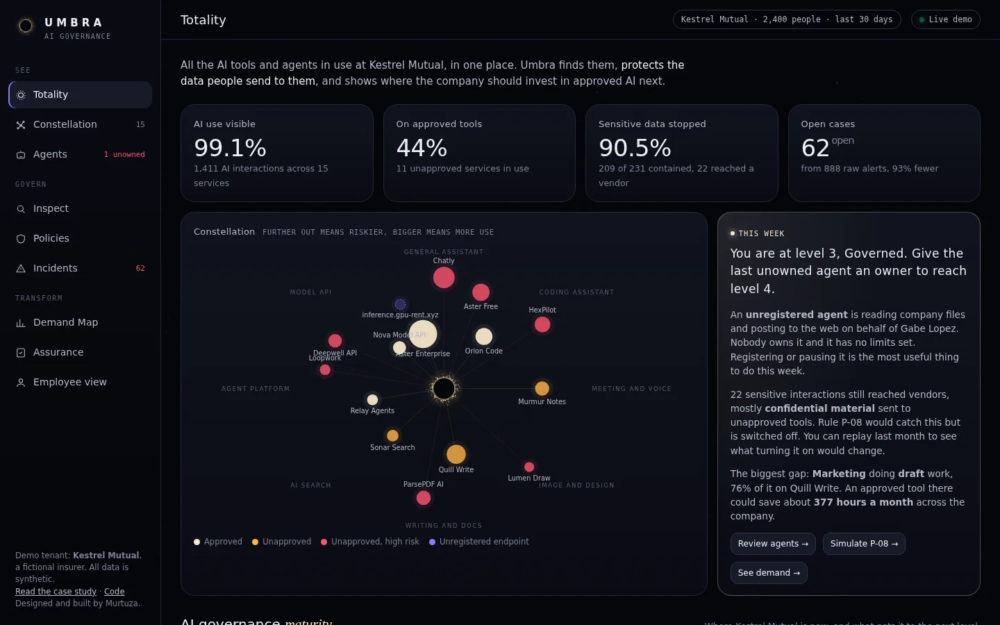
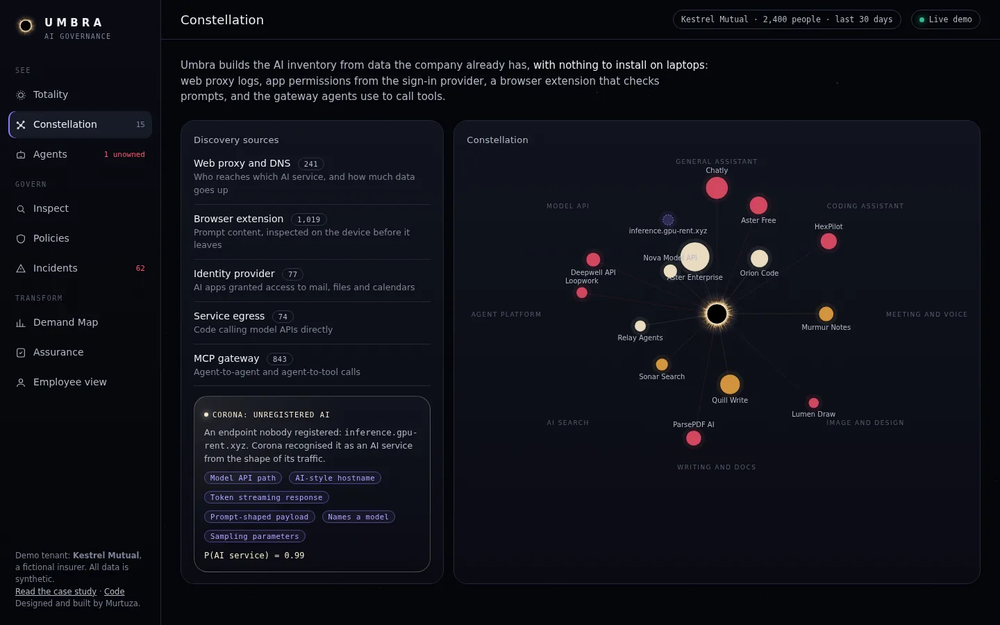
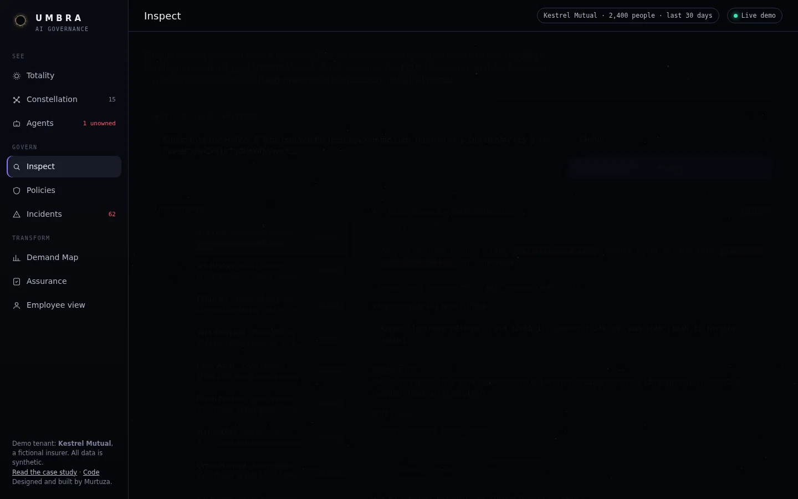
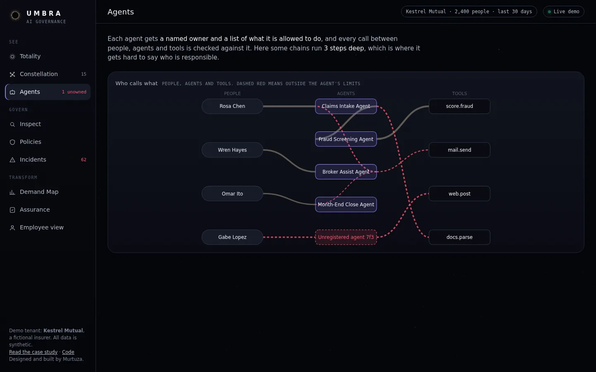
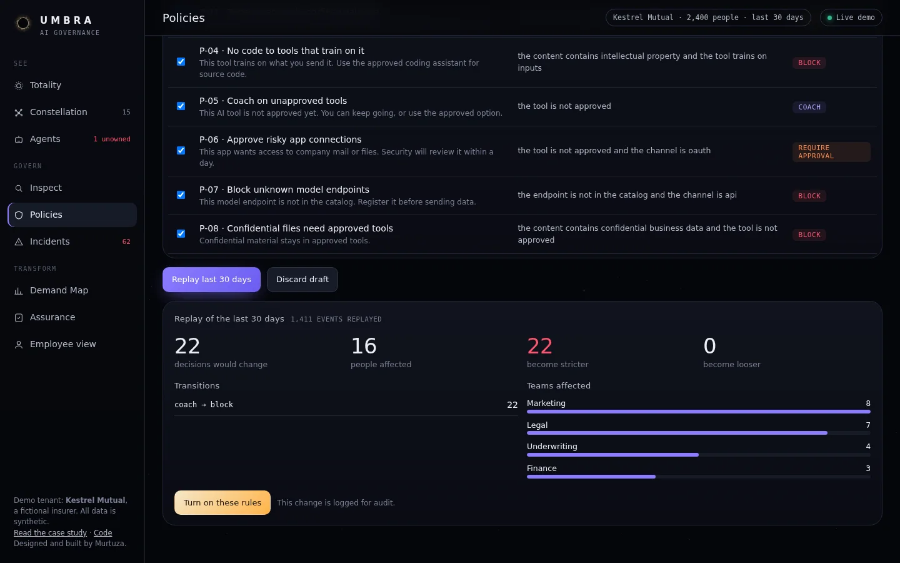
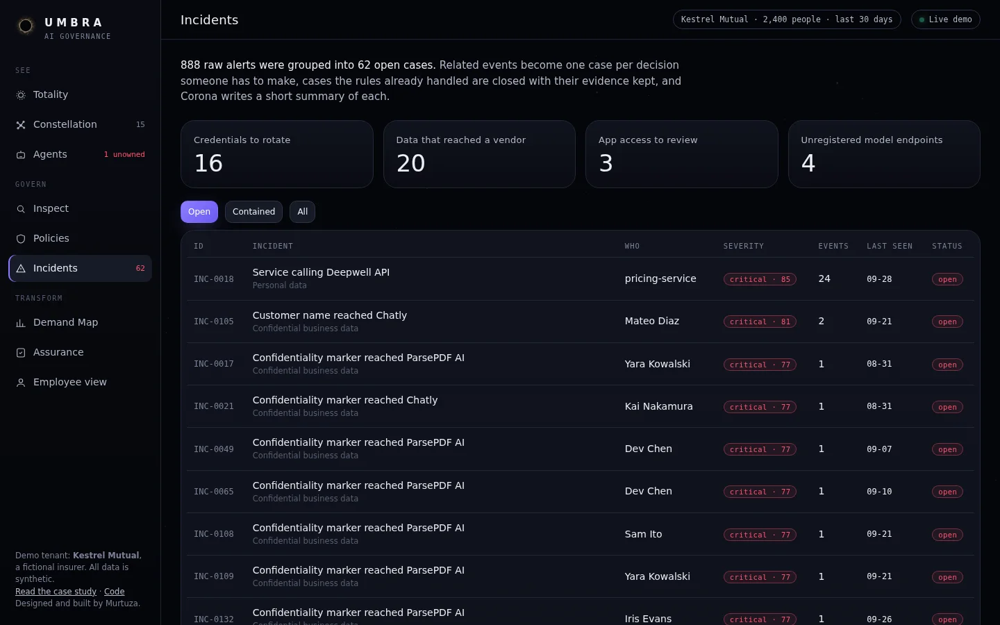
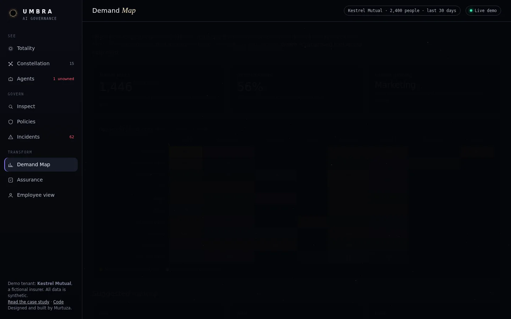
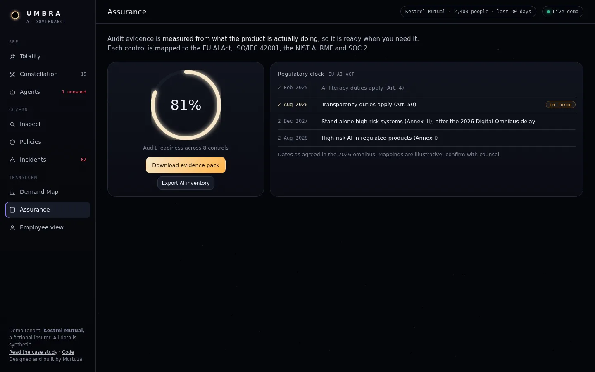
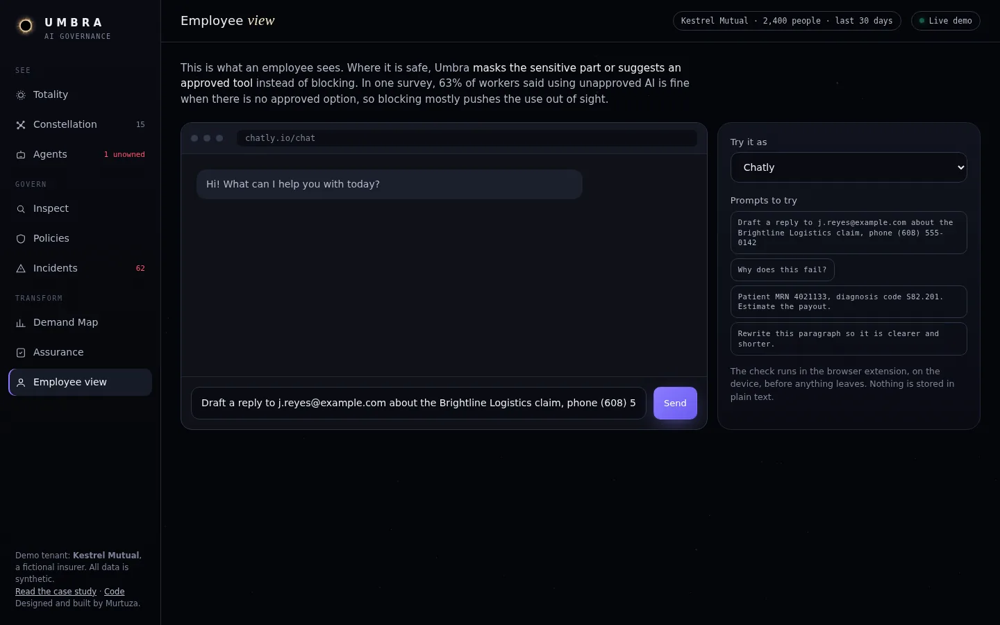

<p align="center"></p>

<h1 align="center">Umbra</h1>
<p align="center">Using AI to govern AI inside a company.</p>
<p align="center"><a href="https://murtuzabuilds.github.io/umbra/"><b>Live console</b></a> · <a href="https://murtuzabuilds.github.io/umbra/case-study.html"><b>Case study</b></a></p>



Umbra is a concept product I designed and built. It shows a company every AI tool and agent its people are using, catches sensitive data before it is sent to them, and turns the unapproved tools it finds into a ranked list of where to invest in approved AI next.

## Why I built it

A lot of people now use AI at work that their employer never approved. In a January 2026 survey of 2,000 workers, 49% said they had, and 63% said it was fine when no approved option existed ([BlackFog, via CIO](https://www.cio.com/article/4124760/roughly-half-of-employees-are-using-unsanctioned-ai-tools-and-enterprise-leaders-are-major-culprits.html)). Blocking tools doesn't really fix that. People just use them somewhere IT can't see.

The early AI security startups were bought by large security vendors in 2024 and 2025, and their tools mostly focus on blocking. I wanted to try a different approach, closer to my background in digital transformation: protect the data, but also learn from what people are trying to do.

## Three ideas behind it

1. **Unapproved AI use shows what people need.** If a team keeps using an unapproved tool for a task, that is a sign they need an approved one. The Demand Map groups this by team and task and ranks where a tool would help most.
2. **AI can help write the rules, but not enforce them.** Umbra's AI layer, Corona, drafts rules from plain English, spots unregistered AI services and summarises incidents. The actual block or allow decision comes from fixed rules that give the same answer every time, and a person approves any new rule.
3. **Agents need owners and limits.** Each agent gets a named owner and a list of what it may do. Every call is checked against that list, and Umbra estimates how much data could be reached through an agent if it were compromised.

## What's in the console

| | |
|---|---|
| **Totality**: how much AI use is visible, the share on approved tools, how much sensitive data was stopped, and open cases | **Constellation**: every AI service on one map, placed by risk and usage |
|  |  |
| **Inspect**: check any text, see what gets masked and which rules applied | **Agents**: who calls what, calls outside the limits, owners and exposure |
|  |  |
| **Policies**: write a rule in a sentence and replay the last 30 days before turning it on | **Incidents**: 888 raw alerts grouped into 62 cases, each with a short summary |
|  |  |
| **Demand Map**: where approved AI would help most, as a now, next and later list | **Assurance**: controls mapped to the EU AI Act, ISO/IEC 42001, NIST AI RMF and SOC 2, with exports |
|  |  |



## The code

Plain JavaScript with no dependencies. The engine lives in `src/` and everything in it is tested.

| File | What it does |
|---|---|
| `catalog.js` | The list of AI services, and a risk score based only on facts you can check about each vendor |
| `detect.js` | Finds sensitive data and confirms matches (Luhn for cards, IBAN checksums, SSN rules), then masks it |
| `policy.js` | Rules as data. The strictest matching rule wins, and every decision records which rules applied |
| `agents.js` | Agent owners and limits, call checks, chain depth, and exposure through other agents |
| `corona.js` | The AI layer: rule drafting, unregistered AI detection, checks for hidden instructions in agent messages, incident summaries |
| `triage.js` | Groups alerts into cases and closes the ones rules already handled |
| `simulate.js` | Replays past activity against a draft set of rules |
| `demand.js` | The Demand Map |
| `compliance.js` | Eight controls measured from live data, framework mappings and the evidence pack |
| `index.js` | Runs everything, plus the maturity scale and the AI inventory export |

```bash
npm test      # 16 tests
npx serve .   # open the console
```

In this prototype, Corona's skills are simple local stand-ins so the demo runs offline and costs nothing. In a real product each one would call an AI model, limited to producing output in the same format, and it would still never make the final decision.

## Business model (proposed)

The target is regulated companies with 500 to 5,000 employees, such as insurers, fintechs, healthcare and legal firms. They would start with a free, read-only 48-hour scan that produces the AI map and the Demand Map. Paid plans would be Govern at $6 per employee per month, Assure at $3 more, and $25 per agent per month. The [case study](https://murtuzabuilds.github.io/umbra/case-study.html) has the full reasoning.

## Brand

The logo is an eclipse: a dark disc for the AI a company can't see, ringed by particles for what Umbra shows, built from the same square particles as my personal logo. In motion the corona turns, twinkles and leans toward your cursor, and a small flare circles the rim.

Colors are Void `#05060A`, Corona `#F5E6C8`, Flare `#FFB347`, Plasma `#8B7CFF` and Aurora `#3BE8B0`. Fonts are Space Grotesk for the interface, Instrument Serif for voice and JetBrains Mono for data. The static mark is `brand/mark.js` and the animated one is `brand/eclipse.js`.

---

Built by [Murtuza](https://github.com/murtuzabuilds). Kestrel Mutual and all vendors in the demo are made up, and the data is generated. The framework mappings are for illustration. MIT licensed.
